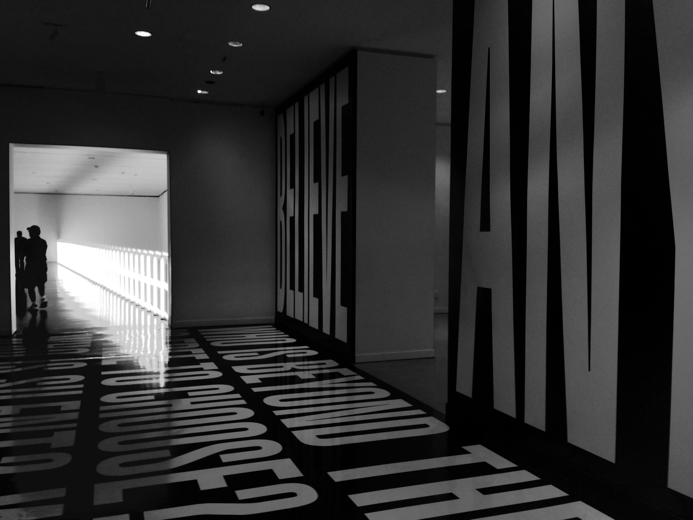

In 2004, I spent some time working as a freelance photojournalist in Washington D.C. I covered Capitol Hill politics, the 911 hearings, and a little of the presidential race. Bush won.

One day, on my way across campus via the mini-underground subway system that connects the buildings, I bumped into then Senator, Barak Obama. To tell you the truth, I didn't know too much about the guy at the time. 

He and I got into one of the 4 person pods, and headed to the next stop. It was just me and him, riding in the little pod together. He asked me about my Nikon, and I told him I was switching to Canon. 

The End.